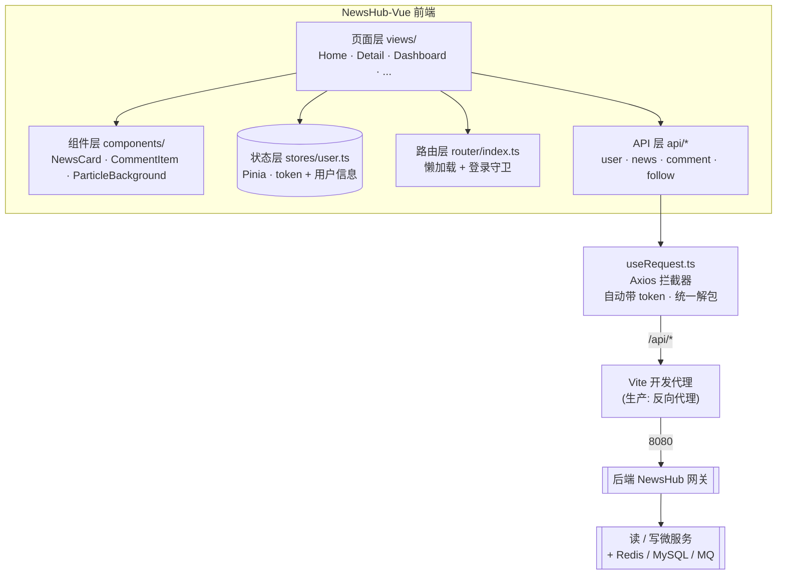
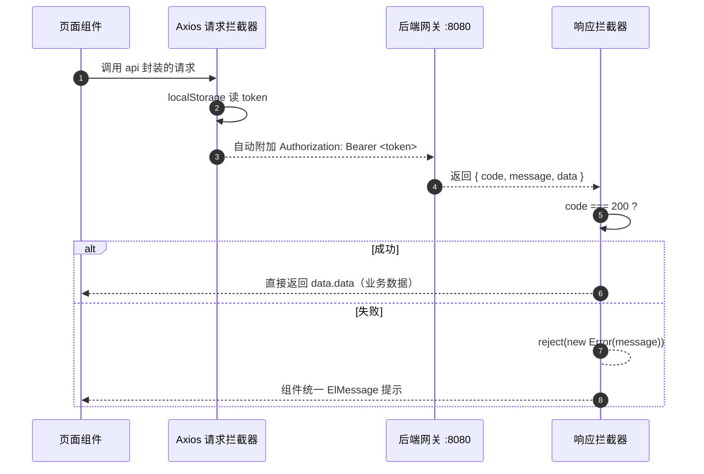
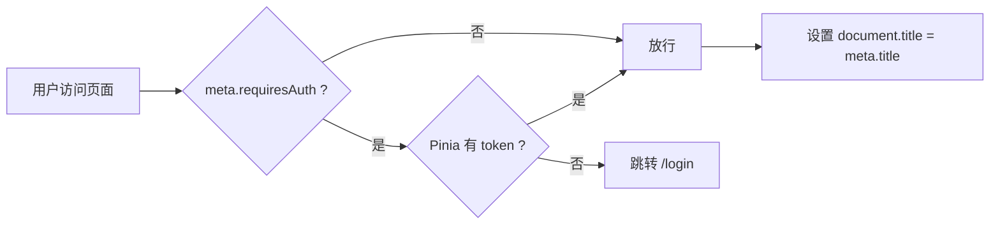

<div align="center">
  
  <h1>NewsHub-Vue</h1>
  <p><strong>NewsHub 社区前端</strong></p>
  <p>Vue 3 + TypeScript + Vite。注册登录、新闻流、嵌套评论、点赞、关注与个性化 Feed，配合后端 <a href="https://github.com/Chillwinner/NewsHub">NewsHub</a>。</p>
  <p>
    <a href="./README.md">简体中文</a> ·
    <a href="./README_en.md">English</a>
  </p>
  <p>
    <a href="https://github.com/Chillwinner/NewsHub-Vue/stargazers"></a>
    
    
    
    <a href="https://github.com/Chillwinner/NewsHub"></a>
  </p>
</div>

> 基于 **Vue 3 + TypeScript + Vite** 的新闻社交前端，配合后端微服务 [NewsHub](https://github.com/Chillwinner/NewsHub) 使用。
> 覆盖用户注册登录、新闻发布与浏览、嵌套评论、点赞、关注关系与个性化 Feed 流等完整体验。

| | |
|---|---|
| 框架 | Vue 3.5（组合式 API + `<script setup>`） |
| 语言 / 构建 | TypeScript 5.9 · Vite 7 |
| 状态 / 路由 | Pinia 3 · Vue Router 5 |
| UI | Element Plus 2（中文语言包） |
| 网络 | Axios 1.13 |
| 设计 | 深色主题 · CSS 设计令牌系统 |

---

## 目录

- [项目简介](#-项目简介)
- [技术栈](#-技术栈)
- [项目结构](#-项目结构)
- [快速部署](#-快速部署)
- [架构设计](#-架构设计)
- [优化点 & 八股文速查](#-优化点--八股文速查)

---

## 🚀 项目简介

NewsHub-Vue 是 **NewsHub 社区新闻平台的前端**，采用 Vue 3 前端工程化最佳实践搭建，核心交互：

- **账号体系**：手机号注册 / 登录 / 退出，登录态持久化，自动恢复用户信息
- **新闻流**：全站新闻分页浏览；登录后一键切换「全部 / 关注」Feed 流
- **新闻操作**：发布 / 编辑 / 删除 / 点赞，仅作者可见编辑入口
- **评论**：评论 + 回复嵌套评论树，点赞、删除
- **关注**：关注 / 取关、粉丝与关注数统计、关注列表、用户主页
- **个人中心**：修改昵称 / 邮箱、查看我的新闻与关注列表

配套后端为 [NewsHub](https://github.com/Chillwinner/NewsHub)（CQRS 微服务，网关统一入口）：

```text
浏览器 (本仓库) --/api--> Vite 代理 --> 后端网关 :8080 --> 读/写微服务
```

---

## 🧱 技术栈

| 技术 | 版本 | 说明 |
|------|------|------|
| Vue | 3.5 | 组合式 API + `<script setup>` |
| TypeScript | ~5.9 | 全量类型系统 |
| Vite | 7 | 构建 / 开发服务器 |
| Pinia | 3 | 全局状态（登录态、用户信息） |
| Vue Router | 5 | 路由 + 登录守卫 |
| Element Plus | 2 | UI 组件库（中文语言包） |
| Axios | 1.13 | HTTP 请求（拦截器统一鉴权 / 解包） |
| Prettier | 3.8 | 代码格式化 |

---

## 📦 项目结构

```
reddit-vue/
├── index.html                    # HTML 入口（标题 NewsHub）
├── package.json                  # 依赖与脚本（newshub-vue）
├── vite.config.ts                # Vite 配置 + /api 代理到后端 :8080
├── tsconfig*.json                # TS 工程配置
└── src/
    ├── main.ts                   # 应用入口：注册 Pinia / Router / Element Plus
    ├── App.vue                   # 全局布局（顶栏导航 + 粒子背景 + 路由出口）
    ├── api/                      # API 封装
    │   ├── user.ts               #   注册 / 登录 / 个人信息
    │   ├── news.ts               #   新闻 CRUD / 分页 / Feed / 点赞
    │   ├── comment.ts            #   评论 CRUD / 树查询 / 点赞
    │   └── follow.ts             #   关注 / 取关 / 粉丝 / 计数
    ├── composables/
    │   └── useRequest.ts         # Axios 实例 + 请求/响应拦截器
    ├── components/               # 通用组件
    │   ├── NewsCard.vue          #   新闻卡片
    │   ├── CommentItem.vue       #   递归评论条目
    │   └── ParticleBackground.vue#   Canvas 粒子背景
    ├── router/index.ts           # 路由表 + 登录守卫 + 页面标题
    ├── stores/user.ts            # 用户状态（token + user，localStorage 持久化）
    ├── styles/m3.css             # 深色主题设计系统（CSS 变量）
    ├── types/index.ts            # 全局类型定义
    └── views/                    # 页面
        ├── Home.vue              #   首页（全部 / 关注 Feed）
        ├── Login.vue / Register.vue
        ├── CreateNews.vue / EditNews.vue
        ├── NewsDetail.vue        #   详情 + 嵌套评论
        ├── Dashboard.vue         #   个人中心
        └── UserProfile.vue       #   用户主页
```

---

## ⚡ 快速部署

### 0. 环境要求

- Node.js `^20.19.0` 或 `>=22.12.0`
- 后端 [NewsHub](https://github.com/Chillwinner/NewsHub) 已启动（网关运行在 `http://localhost:8080`）

### 1. 克隆并安装依赖

```bash
git clone https://github.com/Chillwinner/NewsHub-Vue.git
cd NewsHub-Vue

npm install
```

### 2. 启动开发服务器

```bash
npm run dev
```

浏览器访问 `http://localhost:5173`。

开发模式下 Vite 将 `/api` 请求代理到后端网关 `http://localhost:8080`（见 `vite.config.ts`，如需改后端地址直接修改 `target`）：

```ts
server: {
  proxy: {
    '/api': {
      target: 'http://localhost:8080',   // 后端网关地址
      changeOrigin: true
    }
  }
}
```

### 3. 生产构建

```bash
npm run build          # 类型检查 + 构建（输出到 dist/）
npm run preview        # 本地预览生产构建
npm run type-check     # 仅类型检查
npm run format         # Prettier 格式化 src/
```

> 生产部署时需将 `dist/` 部署到静态服务器，并配置反向代理把 `/api` 转发到后端网关。

---

## 🏗️ 架构设计

### 总体架构



### 请求链路：拦截器统一处理

所有请求都经过同一套 Axios 拦截器，实现「自动鉴权 + 统一解包 + 统一报错」：



### 登录态与路由守卫



- 登录后 token 同时写入 `localStorage`，**刷新页面不丢登录态**（Pinia 初始化时回填）；
- 从 JWT 的 Base64 Payload 解析出 `userId` 后再拉取用户信息，失败时回退用户输入流程;
- 退出登录统一清除 token / user 缓存。

---

## 🧠 优化点 & 八股文速查

### 一、项目做了哪些优化

| 优化点 | 实现方式 |
|--------|----------|
| **统一鉴权** | Axios 请求拦截器自动附加 `Bearer Token`，页面零侵入 |
| **统一解包 / 报错** | 响应拦截器按 `code===200` 解出 `data.data`，失败统一 `reject` + 组件 `ElMessage` 提示 |
| **路由懒加载** | 所有页面 `() => import(...)` 动态导入，首屏只加载当前路由 chunk |
| **路由守卫** | `requiresAuth` 元信息 + 前置守卫拦截未登录访问，同时维护 `document.title` |
| **登录态持久化** | Pinia + localStorage 双写，刷新不掉线，启动即恢复用户 |
| **免额外请求** | 登录后直接解析 JWT Payload 拿 userId（`atob`），再按需拉取用户信息 |
| **并发加载** | 详情页用 `Promise.all` 并行拉取新闻 + 评论；个人页并行拉取用户、新闻、计数 |
| **后端兼容** | 对「分页对象 vs 原生数组」两种响应做归一化处理，兼容不同后端返回 |
| **组件复用** | `NewsCard` / `CommentItem`（递归评论）抽公共件，页面复用 |
| **主题可维护** | 深色设计系统全部走 CSS 自定义属性（tokens），改色只需改变量 |
| **跨域治理** | 开发期 Vite Proxy 解决跨域；生产期反向代理 `/api` 转发 |
| **工程化** | vue-tsc 类型检查 + Prettier 格式化门禁 |

### 二、对应前端八股考点

| 八股问题 | 本项目答案速记 |
|----------|----------------|
| 前端 Token 存哪？安全吗？ | 存 `localStorage`，刷新/跨标签页保留；风险是 XSS 可窃取，可演进为 HttpOnly Cookie 方案 |
| 为什么要 Axios 拦截器 | 请求侧统一注入鉴权头，响应侧统一解包/报错，业务代码不写重复逻辑 |
| 路由懒加载原理 | ES Module 动态 `import()` → 构建时生成单独 chunk，按需加载 |
| Vue Router 守卫分类 | 全局（beforeEach）用于登录校验 + 标题维护；还有路由独享 / 组件内守卫 |
| Pinia vs Vuex | Pinia 组合式、TS 友好、无 mutation 样板；本项目用 setup store + `ref` |
| JWT 前端如何解析 | `token.split('.')[1]` → `atob` 解码 Base64 Payload，取 `sub`/`id` 字段 |
| 异步并发优化 | `Promise.all` 同时发多个请求减少白屏；本文详情页、个人页均使用 |
| 跨域（CORS）解决 | 开发用 Vite Proxy（服务器转发，规避同源限制），生产用 Nginx 反代 |
| 组件通信方案 | Props + Emits 为主、Pinia 共享全局态（登录态）、provide/inject 按需 |
| 深色主题实现 | CSS 自定义属性（design tokens）+ 浏览器继承，避免组件库逐一覆盖 |
| 前端如何应对接口结构变化 | 拦截器统一解包 + 页面层做数组/分页对象归一化兼容 |
| 首屏性能 | 路由懒加载 + 骨架屏（el-skeleton）+ 静态资源 CDN 字体 |

---

## 📄 License

MIT